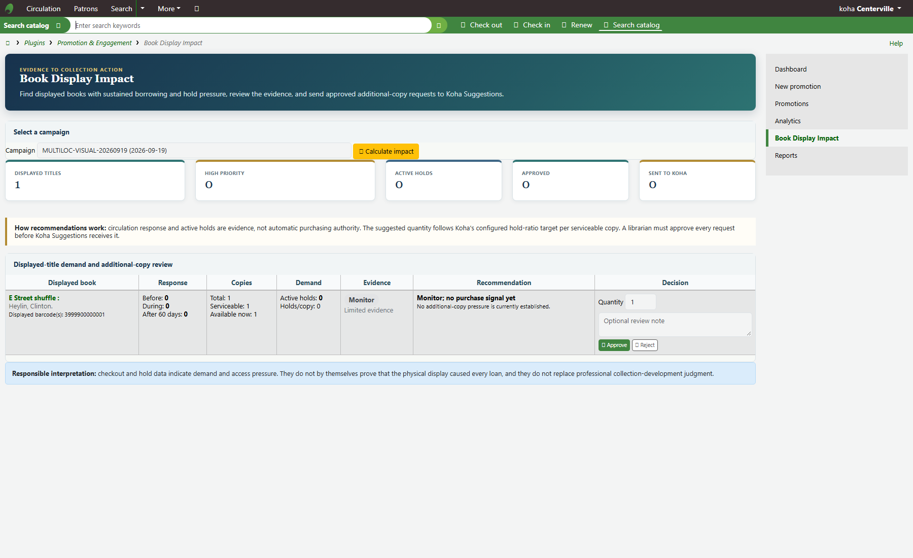

# Koha Promotion & Engagement

Koha Tool Plugin for recording library promotion activity and measuring whether promoted resources are actually being used, while keeping Koha as the source of truth.

> **Status: development candidate. Koha 25.11.02 local runtime gates pass; Koha 26.05 and institutional staging remain release gates.**

## Problem this plugin solves

Libraries invest staff time in physical displays, email campaigns, recommendations and other promotion, but Koha normally records the resulting circulation without connecting it back to the promotional activity.

This plugin answers:

- What did we promote?
- How many promoted titles were actually borrowed?
- What percentage of the promoted collection was used?
- How many checkout transactions occurred during the campaign?
- Did circulation improve compared with an equal pre-campaign baseline?
- Which promoted titles increased, generated no response or produced repeat demand?
- Is there hold/copy pressure worth collection-development review?
- Which channels/audiences/types/locations perform differently when attribution is defensible?

The plugin reports observed circulation response; it does not claim that a promotion caused every loan.

## Target compatibility

- Primary verified runtime: Koha 25.11.02
- Forward test target: Koha 26.05.x
- Initial institutional target: Aljamea-tus-Saifiyah Nairobi after the required staging/release gates

## Core architecture

Koha remains authoritative for bibliographic records, items, barcodes, patrons, branches, holds and circulation. The plugin stores only promotion-specific operational data in seven namespaced plugin tables.

The v0.6.0 candidate includes:

- Campaign create/list/detail/edit/archive with audit history
- Universal campaign types, channels and reusable multi-location configuration
- Bulk barcode scan/paste with live Koha validation
- Active campaigns measured automatically through today without forced completion
- Equal-duration Baseline and During comparison
- After 7/14/30/60 windows with Pending / To date / Complete states
- Clear distinction between promoted titles and promoted copies/items
- Titles Issued / Borrowed and Title Utilization
- Campaign checkouts, baseline checkouts and circulation-rate change
- Titles with Increased Issues, Zero-Response and Repeat-demand title signals
- Portfolio de-duplication and overlap/multi-attribution handling
- Privacy-aware channel, location, type, language and audience comparisons
- Engagement-first Koha-native Dashboard, Promotions, Campaign Detail, Analytics and Reports
- Searchable campaign/vocabulary selectors, multi-campaign comparison, sortable/filterable/exportable tables
- Campaign Analytics and Comparative Report charts with data labels, Table View and JPEG download
- Page-specific beginner-friendly **How to Use** guidance across the main workflow
- CSV/JSON exports
- Authenticated health and read-only campaign Analytics API
- **Promoted Resource Impact** combining engagement evidence with holds/copy pressure
- Audited librarian approval/rejection and native Koha Purchase Suggestions handoff

The internal acquisition workflow continues to use the stable Koha Suggestion reason `Book Display Impact`.

Documentation:

- [Installation SOP](docs/INSTALLATION_SOP.md)
- [Resource Impact / Book Display Impact user guide](docs/BOOK_DISPLAY_IMPACT_USER_GUIDE.md)
- [v0.5 analytics definitions and page architecture](docs/brain/V0.5_ANALYTICS_INTELLIGENCE.md)
- [v0.6 usability and visualization](docs/brain/V0.6_USABILITY_VISUALIZATION.md)
- [Analytics Engine Specification](docs/brain/ANALYTICS_SPEC.md)
- [KohaCon26 demo and video package](docs/KOHACON26_DEMO_AND_VIDEO.md)
- [Public release and legal guidance](docs/PUBLIC_RELEASE_GUIDE.md)
- [Koha upgrade survival audit and SOP](docs/UPGRADE_SURVIVAL_AUDIT.md)

Later milestones include recurring campaigns, non-barcode resources, historical import, Koha 26.05 runtime validation and institutional staging.

## Safety rules

1. Never patch Koha core for plugin functionality.
2. Never add columns to Koha core database tables.
3. Use namespaced plugin-owned tables only.
4. Treat Koha as the source of truth for catalogue and circulation data.
5. Do not silently destroy historical promotion data on uninstall.
6. Test releases in Koha Testing Docker (KTD) and staging before production.
7. Use least-privilege staff and API accounts.
8. Do not expose patron-identifiable analytics to general external dashboards.

## Development lifecycle

`source -> static checks -> KTD 25.11 -> KTD 26.05 -> AJSN staging -> versioned KPZ -> production`

See `docs/ARCHITECTURE.md`, `docs/SAFETY.md`, `docs/ROADMAP.md`, and `docs/REAL_WORLD_USE_CASES.md`.

Release verification is recorded in `docs/brain/V0.3_RELEASE_GATE_REPORT.md`; the user acceptance path is in `docs/brain/MONDAY_ACCEPTANCE.md`.
