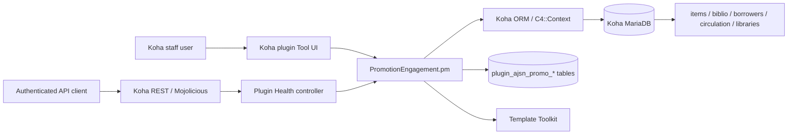
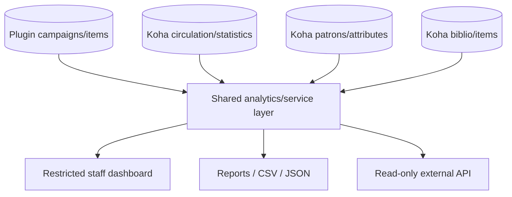
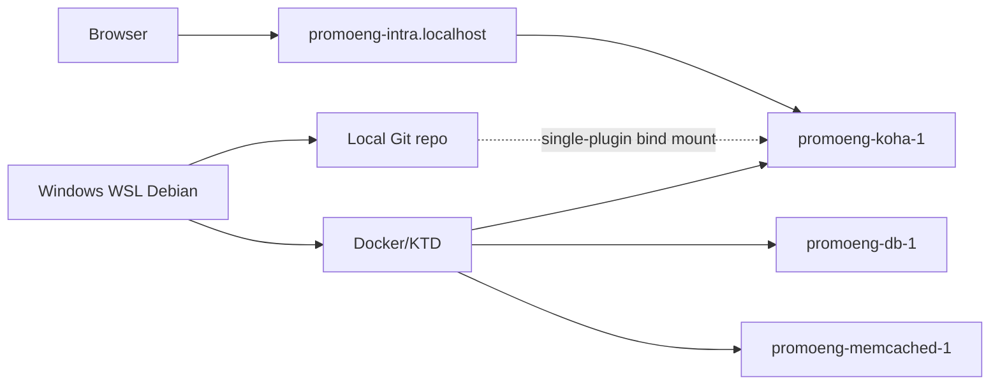

# Architecture

## 1. Architectural principle

**Koha stores library truth; the plugin stores promotion truth.**

Current source confirms that the plugin uses Koha's live item/library APIs for validation and stores campaign-specific metadata, item links, audit data, and settings in namespaced plugin tables. It does not add columns to Koha core tables.

## 2. Current architecture



### Current implementation components

- `Koha/Plugin/Com/AJSN/PromotionEngagement.pm`
  - plugin metadata/version;
  - `tool` entry point;
  - dashboard;
  - new-promotion form orchestration;
  - campaign validation and transactional save;
  - schema creation/upgrade;
  - API namespace/routes.
- `Koha/Plugin/Com/AJSN/PromotionEngagement/dashboard.tt`
  - campaign/item counts;
  - recent campaign table;
  - v0.2 checkpoint status;
  - placeholders for analytics/reporting.
- `Koha/Plugin/Com/AJSN/PromotionEngagement/new_promotion.tt`
  - campaign form;
  - Koha-native CSRF token/op convention;
  - barcode input and error/warning rendering.
- `Koha/Plugin/Com/AJSN/PromotionEngagement/configure.tt`
  - foundation configuration/status view; writable configuration is not yet the operational configuration system.
- `Koha/Plugin/Com/AJSN/PromotionEngagement/openapi.json`
  - currently exposes `/health` under the plugin namespace.
- `Koha/Plugin/Com/AJSN/PromotionEngagement/API/Health.pm`
  - authenticated health response; current code reads the authoritative plugin `$VERSION`.
- `scripts/build_kpz.py`
  - packages Git-tracked plugin source under `Koha/` into a KPZ and checksum.

## 3. Data ownership

### Koha-owned and authoritative

The plugin should read these sources rather than create competing copies:

- bibliographic records (`biblio` and related Koha APIs);
- items and barcodes (`items`, `Koha::Items`);
- patrons and extended attributes;
- branches/libraries (`Koha::Libraries`);
- locations and authorized values where adopted for configuration;
- circulation/statistics/history used for analytics.

### Plugin-owned

Current schema:

- `plugin_ajsn_promo_campaigns`
- `plugin_ajsn_promo_items`
- `plugin_ajsn_promo_audit`
- `plugin_ajsn_promo_settings`

See `DATA_MODEL.md` for exact verified fields.

### Historical architecture conflict

An earlier planning artifact referenced a promotion `events` table. Current source does **not** implement `plugin_ajsn_promo_events`; it implements `plugin_ajsn_promo_settings` instead. Treat the current source as authoritative. If a future event/occurrence model is needed for recurring campaigns or analytics, introduce it through an explicit schema decision/migration rather than assuming the old planned table already exists.

## 4. Campaign creation flow

```mermaid
sequenceDiagram
    participant S as Staff user
    participant UI as New Promotion UI
    participant P as Plugin
    participant K as Koha Items/Libraries
    participant DB as MariaDB

    S->>UI: Submit campaign + optional barcodes
    UI->>P: POST cud-create_promotion + CSRF token
    P->>P: Validate type/channel/name/dates/status
    P->>K: Validate selected library
    loop each unique barcode
        P->>K: Find live Koha item by barcode
    end
    alt Any validation/invalid barcode error
        P-->>UI: Re-render form; save nothing
    else Valid submission
        P->>DB: BEGIN
        P->>DB: INSERT campaign
        P->>DB: INSERT unique campaign-item links
        P->>DB: INSERT campaign_created audit row
        P->>DB: COMMIT
        P-->>UI: Dashboard + success/warning
    end
```

Key integrity rules:

- duplicate barcode text is de-duplicated before lookup;
- invalid barcodes block the whole save;
- database writes occur in one transaction;
- the unique `(campaign_id,itemnumber)` constraint protects against duplicate campaign-item links;
- database failures roll back partial data.

## 5. Authentication and authorization

### Staff Tool UI

The Koha plugin runner enforces access to the plugin `tool` method. v0.2 write POSTs follow Koha's CSRF middleware convention (`op` beginning with `cud-` plus a generated CSRF token).

### REST API

Current route:

`GET /api/v1/contrib/ajsn_promotion/health`

The OpenAPI definition requires Koha `catalogue` permission and documents 401/403 responses. Future APIs must use least privilege and avoid leaking patron-identifiable analytics.

## 6. Current dashboard architecture

The dashboard queries plugin tables directly for:

- count of non-deleted campaigns;
- count of non-deleted campaign-item links;
- ten most recent non-deleted campaigns.

Conversion analytics are not implemented; the template explicitly labels them as a later analytics phase.

## 7. Planned analytics architecture

Future analytics should derive results from Koha circulation/statistics rather than copy transaction history into a competing ledger.

Recommended shape, consistent with approved decisions:



The shared analytics/service layer is **planned, not current**. Its purpose is to ensure staff UI, exports and external APIs cannot calculate the same KPI differently.

Expected measures include before/during/after circulation, 7/14/30/60-day windows, unique-resource conversion, days-to-first-checkout, location/channel/subject/audience performance, and restricted top-user/class/group benefit analytics.

## 8. Planned configuration architecture

Current code uses generic hard-coded type/channel enums and free-text audience/language/location fields. The approved direction is configurable reusable dimensions.

Likely future entities include campaign type, channel, location, language, audience and cadence vocabularies. **Exact tables and whether values come from Koha authorized values or plugin-managed configuration are NEEDS-VERIFICATION and must not be invented prematurely.**

One campaign must eventually support multiple locations. A normalized many-to-many relation is expected conceptually, but no schema is approved yet.

## 9. E-resource/non-item architecture

A future campaign may promote an electronic resource, author, collection, theme, or external resource that has no physical item barcode. Therefore `plugin_ajsn_promo_items` cannot be the only long-term promoted-object model. Current campaign creation can save with zero barcodes, preserving room for this evolution. The exact resource abstraction remains planned.

## 10. Deployment topology

### Local development



- Primary active local instance: `promoeng`.
- Legacy/shared `kohadev` is not used for current feature verification.
- Primary verified Koha runtime: 25.11.02.
- Plugin source is mounted using KTD `--single-plugin` during feature development.
- Exact candidate KPZ packages are also uploaded through Koha's normal plugin uploader for release-gate testing.
- Historical disposable instances proved clean install/upgrade/rollback for earlier milestones.
- Koha 26.05 runtime remains blocked by host disk capacity; a 2026-09-21 pull was stopped safely before a container/image was completed.

### Staging/production

Required lifecycle:

`source -> static checks -> isolated KTD 25.11 -> exact KPZ -> KTD 26.05 -> institutional staging -> approved package/checksum + backup/rollback -> production`

v0.5 is locally verified on Koha 25.11.02. Institutional staging and formal v0.5 production deployment are not yet verified.

## 11. Legacy/superseded architecture

- v0.1 New Promotion was intentionally read-only; v0.2 supersedes it with a writable transactional workflow.
- Health API previously duplicated version `0.1.0`; current code uses the plugin `$VERSION`.
- The old plan's events table is not current schema.

## 12. Architectural invariants future agents must preserve

1. Do not mutate Koha core schema for plugin needs.
2. Do not create a second circulation source of truth.
3. Keep plugin schema namespaced and upgradeable.
4. Keep writes transactional when campaign and related records must stay consistent.
5. Preserve historical data across disable/re-enable/uninstall unless an explicit purge workflow is separately approved.
6. Keep analytics logic shared across interfaces.
7. Keep institution-specific vocabulary configurable.
8. Treat patron-level analytics as restricted data, not a public dashboard feature.
## Promoted Resource Impact / Book Display Impact boundary

The staff-facing v0.5 page is **Promoted Resource Impact**. It can analyse any
item-linked promotion, not only a physical display.

The module reads campaign links from plugin tables and catalogue/circulation/item/
hold evidence from Koha. Engagement calculations come from the shared Analytics
service; the module does not maintain separate KPI SQL.

It persists only plugin review state/evidence snapshots. Approved handoff uses
`Koha::Suggestion`; it never creates acquisition orders or patches Koha core.

The internal route `book_display_impact` and native Suggestion management reason
`Book Display Impact` remain stable for backward compatibility.

Primary staff-facing evidence is title engagement/utilization. Holds, priority,
approval and Sent-to-Koha are secondary collection-development workflow signals.
