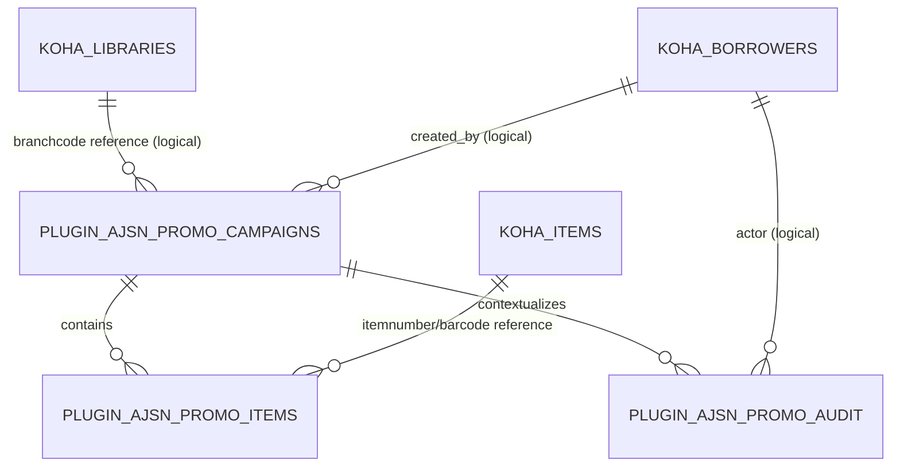

# Data Model

## Authority model

### Koha is authoritative for

- bibliographic records;
- items and barcodes;
- patrons/borrowers and patron attributes;
- libraries/branches;
- circulation/statistics/history;
- locations/authorized values if later adopted for campaign configuration.

The plugin must not create competing canonical copies of these domains.

### Plugin is authoritative for

- campaigns/promotion metadata;
- campaign-to-Koha-item links;
- plugin audit records;
- plugin configuration/settings.

## Current verified plugin schema

Current source creates four tables.

### `plugin_ajsn_promo_campaigns`

| Field | Type/meaning |
|---|---|
| `campaign_id` | BIGINT unsigned auto-increment primary key |
| `campaign_uuid` | CHAR(36), unique stable campaign identifier |
| `campaign_type` | VARCHAR(80), required |
| `channel` | VARCHAR(80), nullable; added idempotently for v0.2 |
| `name` | VARCHAR(255), required |
| `start_date` | DATE, required |
| `end_date` | DATE, nullable |
| `branchcode` | VARCHAR(10), nullable Koha library reference by code |
| `target_audience` | VARCHAR(255), nullable free text currently |
| `language_code` | VARCHAR(30), nullable/free text currently |
| `display_location` | VARCHAR(255), nullable single free-text location currently |
| `notes` | TEXT, nullable |
| `status` | VARCHAR(30), default `draft`; code currently permits draft/active/completed |
| `created_by` | INT nullable; Koha user/borrower number from `C4::Context->userenv` |
| `created_at` | DATETIME default current timestamp |
| `updated_at` | DATETIME automatically updates |
| `deleted_at` | DATETIME nullable; soft-delete infrastructure only, no current workflow |

Indexes: UUID unique, date pair, branchcode, status.

### `plugin_ajsn_promo_items`

| Field | Type/meaning |
|---|---|
| `campaign_item_id` | BIGINT unsigned auto-increment PK |
| `campaign_id` | BIGINT unsigned FK to campaigns |
| `itemnumber` | INT, live Koha item identifier |
| `barcode` | VARCHAR(100), stored snapshot/linking convenience |
| `added_by` | INT nullable Koha actor |
| `added_at` | DATETIME default current timestamp |
| `deleted_at` | DATETIME nullable |

Constraints/indexes:

- unique `(campaign_id,itemnumber)`;
- itemnumber index;
- barcode index;
- FK campaign with `ON DELETE CASCADE`.

Important: Koha `items` remains authoritative. The plugin validates the barcode against `Koha::Items` before storing the link.

### `plugin_ajsn_promo_audit`

| Field | Type/meaning |
|---|---|
| `audit_id` | BIGINT unsigned auto-increment PK |
| `campaign_id` | BIGINT nullable reference context |
| `actor_borrowernumber` | INT nullable Koha actor |
| `action_type` | VARCHAR(80), e.g. current `campaign_created` |
| `entity_type` | VARCHAR(80), current creation uses `campaign` |
| `entity_id` | VARCHAR(100), current campaign UUID |
| `details_json` | LONGTEXT encoded JSON details |
| `created_at` | DATETIME default current timestamp |

Indexes: campaign, actor, created timestamp.

Current audit action types now include campaign_created, campaign_updated, campaign_status_changed, and campaign_archived.

Update audit details record changed fields plus added/removed itemnumbers. Archive audit details record campaign identity/status and number of active links archived.

### `plugin_ajsn_promo_settings`

| Field | Type/meaning |
|---|---|
| `setting_key` | VARCHAR(100) primary key |
| `setting_value` | LONGTEXT nullable |
| `updated_at` | DATETIME auto-updated |

Foundation lifecycle testing used a temporary `lifecycle_test` key to verify disable/re-enable persistence.

## Current relationships

Not every logical Koha reference is enforced as a database foreign key; validation is performed through Koha APIs where implemented.

## Transaction rules

- Campaign creation performs campaign insert, item-link inserts and audit insert in one transaction.
- Campaign update validates all submitted barcodes before any write, then updates metadata, reconciles item links and writes audit rows in one transaction.
- Removing an item sets campaign-item deleted_at; it does not hard-delete the row.
- Re-adding the same item reactivates the existing unique campaign-item row.
- Campaign archive sets campaign deleted_at, soft-deletes active campaign-item links, and writes campaign_archived in one transaction.
- Archived rows remain physically present for history/audit; active list/detail/dashboard queries exclude archived campaigns/links.
- DB exceptions trigger rollback so partial lifecycle writes are not kept.

## Current input normalization

Barcode input is split on line breaks, comma or semicolon; whitespace is trimmed; exact duplicate values are discarded before Koha lookup. Each unique barcode is looked up against live Koha items.

## Schema evolution

`_ensure_schema` is called from install, upgrade and major plugin screens. It creates missing tables and idempotently adds the `channel` column when absent.

This is an early migration strategy; as schema complexity grows, use explicit versioned/idempotent migrations and document them.

## Historical conflict: planned events table

An early planning artifact described an events table. Current source does not contain it. Do not assume it exists. Current fourth table is settings.

## Planned data-model extensions — not yet schemas

### Multi-location campaigns

Requirement: one campaign can appear at multiple physical/digital locations and analytics can compare them. A normalized many-to-many relation is likely, but table names/fields are **not approved**. Decide source vocabulary first (Koha authorized values, plugin-managed, hybrid).

### Configurable vocabularies

Campaign type, channel, language, audience, cadence and location should become manageable reusable values. Current hard-coded/free-text approach is temporary.

### Promoted resources beyond items

E-resources/authors/themes/external URLs may not map to `items.itemnumber`. A future resource abstraction is required. Do not overload fake barcodes.

### Analytics

Preferred architecture is derived calculation from Koha circulation/statistics rather than copying all transaction history. If caching/materialization is introduced for performance, it must be explicitly documented as derived data with refresh/invalidation rules.

## Data-quality concerns

- Manual barcode transcription can cause false invalid-barcode errors; use scanner/direct Koha value where possible.
- Free-text location/language/audience fields will fragment analytics until controlled vocabularies exist.
- Patron class/Darajah/group analytics depend on reliable authoritative patron attributes; source field mapping is not yet verified.
- Repeated campaigns may promote the same item; analytics must distinguish campaign-item link uniqueness from global item uniqueness.

## Privacy

Patron identifiers are available through Koha for staff analysis but must not be copied/exposed unnecessarily. Any user-ranking feature needs explicit access controls and aggregation/privacy review.
## v0.4 recommendation table

`plugin_ajsn_promo_recommendations` stores one decision per campaign and Koha
biblionumber. Fields include decision status, reviewed quantity, reviewer note,
evidence JSON snapshot, reviewer/timestamps and the resulting Koha suggestion ID.
The unique campaign/biblionumber key prevents duplicate plugin recommendations.
Koha's `suggestions` table remains authoritative after submission.
